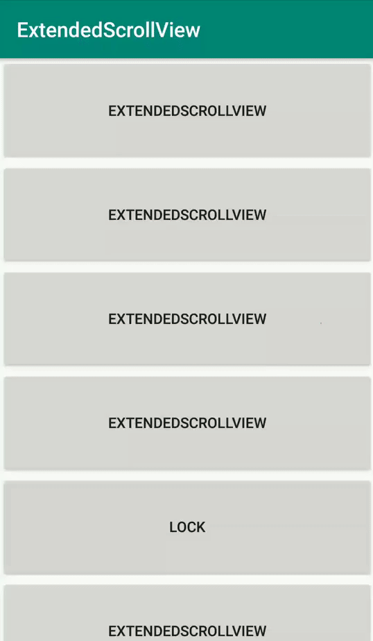

# ExtendedScrollView
	
Android's extended scroll view, based on NestedScrollView

DEMO
---



USAGE
---

Using ExtendedScrollView in your application.
Add dependencies in build.gradle of your module.

```groovy
dependencies {
  implementation 'com.riningan.widget:extendedscrollview:1.1'
}
```

XML
-----

```xml
<com.riningan.widget.ExtendedScrollView
    android:layout_width="match_parent"
    android:layout_height="match_parent"
    app:scroll_enabled="false">
  ...
</com.riningan.widget.ExtendedScrollView>
```

```xml
<attr name="scroll_enabled" format="boolean" />
```

JAVA
-----

```java
ExtendedScrollView extendedScrollView = findViewById(R.id.extendedScrollView);
extendedScrollView.setScrollEnabled(false);
```

LICENCE
-----

  	Licensed under the Apache License, Version 2.0 (the "License");
	you may not use this file except in compliance with the License.
	You may obtain a copy of the License at
	
	   http://www.apache.org/licenses/LICENSE-2.0
	
	Unless required by applicable law or agreed to in writing, software
	distributed under the License is distributed on an "AS IS" BASIS,
	WITHOUT WARRANTIES OR CONDITIONS OF ANY KIND, either express or implied.
	See the License for the specific language governing permissions and
	limitations under the License.
